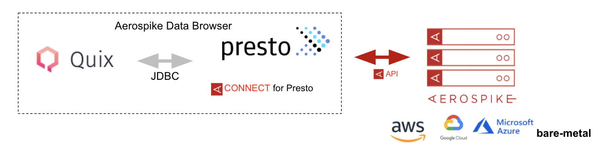
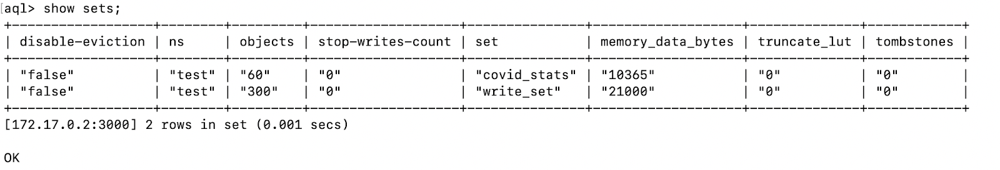
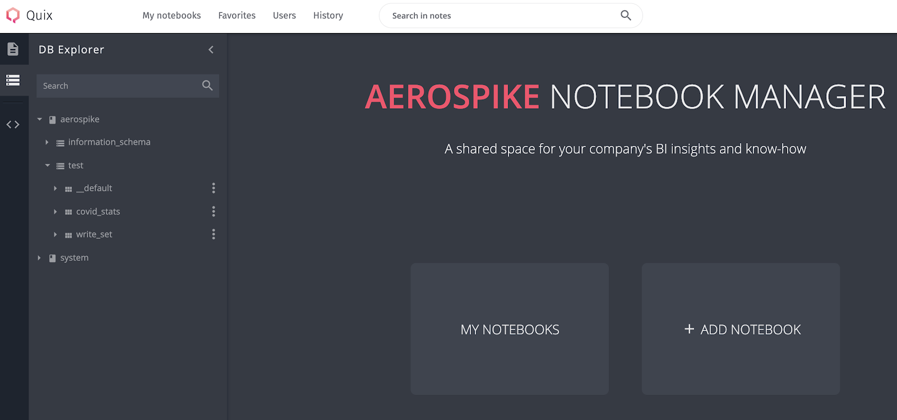
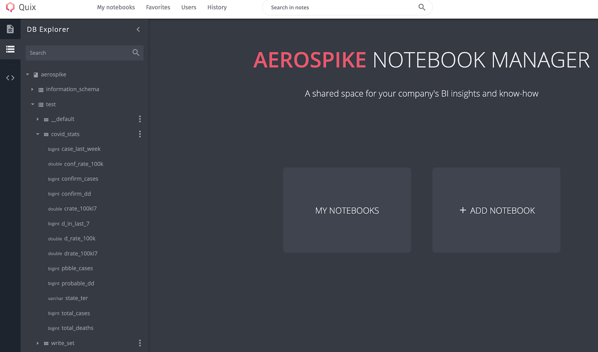
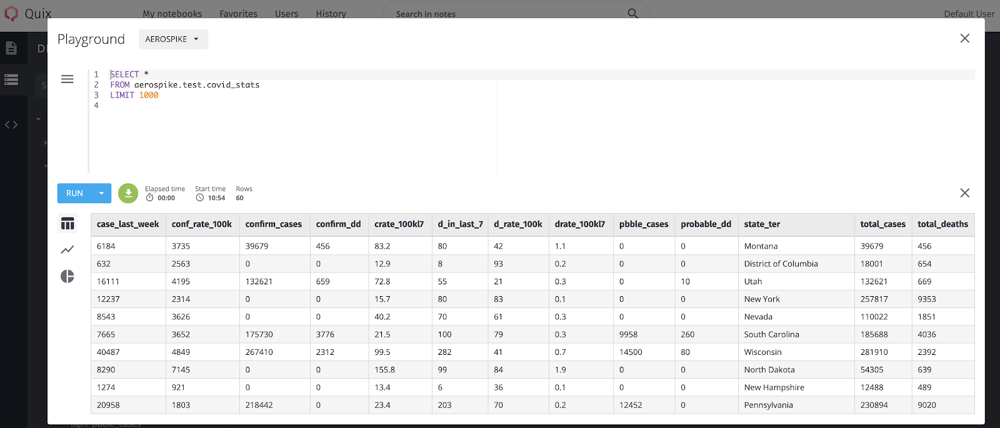
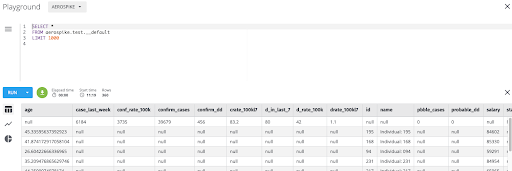
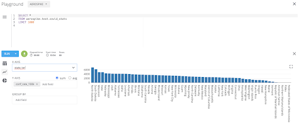
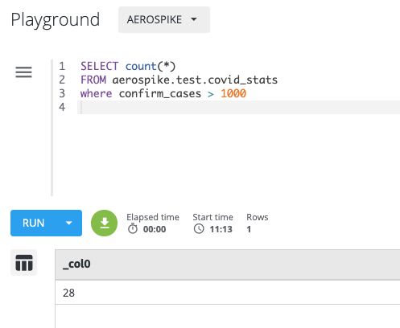

# Aerospike Data Browser

Aerospike data browser is a stand-alone desktop application that lets you discover data stored in the Aerospike database and run ANSI SQL queries against it.

## Salient Features
* View namespace/set/schema of data stored in Aerospike, without the need to know the schema apriori.
* Run ANSI SQL queries for data exploration, including [aggregate functions](https://prestosql.io/docs/current/functions/aggregate.html) for descriptive analytics.
* Visualize data.

**Note:** The data browser is not an analytics tool and should not be used for complex analysis of large datasets.

## Architecture


It is a stack combining Quix, [Presto](https://prestosql.io/), and the [Aerospike Connector for Presto](https://www.aerospike.com/docs/connect/access/presto/index.html#), and is dockerized.
The Quix UI provides a DB Explorer and a SQL editor, in addition to a notebook manager for managing your notebooks.
Presto exposes a JDBC interface to Quix and uses the Aerospike Connector to translate SQL queries into API calls to the DB. 

## Prerequisites
1. Aerospike server is not a part of this package, so make sure you have a server instance running and populated with data that you would like to explore.
Refer to the blog on [launching an Aerospike server in a docker environment](https://dev.to/aerospike/getting-started-with-aerospike-on-docker-532f) if you need to and use one of the [Aerospike clients](https://www.aerospike.com/docs/client/) to populate it with data.
2. Docker Desktop is installed.

## Step 1: Launch the Data Browser using Docker
Run the docker command:
```bash
docker build . -t aerospike-data-browser
docker run -d -p 3000:3000 -p 8081:8081 --name data-browser aerospike-data-browser
```

Quix runs on port 3000 by default, hence launch the Aerospike server on the 3300 port if you are planning to run both on the localhost.
Below is the list of environment variables you can specify to configure the data browser using the [-e](https://docs.docker.com/engine/reference/commandline/run/#set-environment-variables--e---env---env-file) option.

| Variable | Description | Default Value |
| --- | --- | --- |
| AS_HOSTLIST | Aerospike host list, a comma separated list of potential hosts to seed the cluster. |  |
| TABLE_DESC_DIR | Path of the directory containing table description files. | /usr/lib/presto/etc/aerospike |
| SPLIT_NUMBER | Number of Presto splits. See Parallelism section for more information. | 4 |
| CACHE_TTL_MS | Schema inference cache TTL in milliseconds. | 1800000 |
| DEFAULT_SET_NAME | Table name for the default set. | __default |
| RECORD_KEY_NAME | Column name for the record's primary key. | __key |
| RECORD_KEY_HIDDEN | If set to false, the primary key column will be available in the result set. | true |
| INSERT_REQUIRE_KEY | Require the primary key on INSERT queries. Although we recommend that you provide a primary key, you can choose not to by setting this property to false, in which case a UUID is generated for the PK. You can view it by setting aerospike.record-key-hidden to false for future queries. | true |

Make sure that the data browser container is running by using the `docker ps -a` command.

Access the UI at http://localhost:3000/ (assuming that you haven’t changed the default port).

## Step 2.a: Browse data

`covid_stats` and `write_set` are two sets that were created in the namespace called `test` in an Aerospike cluster called `aerospike`.



You can now view the namespace and the sets in the DB explorer on the side bar. 



You can ignore the information schema and system tables in the DB explorer because those are not required.

Additionally, you can also view the schema of the sets. Notice that there’s no need to specify the schema. The data browser detects (infers) the schema for you.



## Step 2.b: Run SQL queries and Visualize data

The UI has a built-in SQL editor that you can use to run ANSI SQL queries. Here are the supported SQL statements:
* SHOW CATALOGS
* SHOW SCHEMAS
* USE
* SHOW TABLES
* DESCRIBE
* SELECT 
* INSERT INTO
* EXPLAIN

Note that a catalog corresponds to an Aerospike cluster name, schema to a namespace, and table to an Aerospike set name.
See [SQL syntax page](https://trino.io/docs/current/sql.html#sql--page-root) for examples and more information.

If you click on the triple dots next to the set name, a sample SQL query is already generated for you that you can edit as you see fit. Here’s an example:

```sql
SELECT *
FROM aerospike.test.covid_stats
LIMIT 1000
```



**Note:** If you choose not to define sets (which is optional in Aerospike), but rather directly store data into a namespace in your data model,
you would have to use the null set or the `__default` set (see `__default` set in the DB Explorer).  The default set contains all the records that were stored in the namespace.
It’s name can be changed by configuring the parameter `DEFAULT_SET_NAME`.

```sql
SELECT *
FROM aerospike.test.__default
LIMIT 1000
```



To use the primary key in a WHERE clause, use `__key` in the WHERE clause. You can change the name of the key column, which defaults to `__key`, by configuring the environment variable `RECORD_KEY_NAME` in the docker run command. For example,

```sql
SELECT *
FROM aerospike.test.covid_stats
WHERE __key = “New York”
```

You can also visualize the data using the charting capabilities built into the QUIX UI.



Finally, you can run [aggregate functions](https://prestosql.io/docs/current/functions/aggregate.html) for descriptive analytics. For example,



## License
MIT
